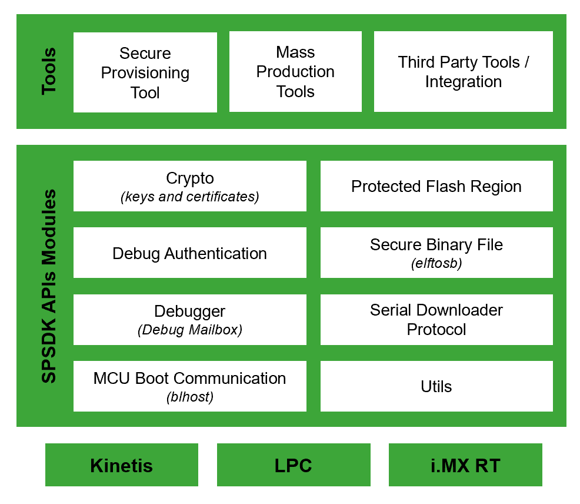

NXP Secure Provisioning SDK
===========================

**Secure Provisioning SDK (SPSDK)** allows the user to connect and communicate with a device; configure the device; prepare, download and upload data including security operations. It is delivered in a form of python library and command line applications.

* [Documentation](https://spsdk.readthedocs.io)

Architecure
-----------


Dependencies
------------

- requirements.txt
  - list of requirements for running SPSDK core + apps
- requirements-develop.txt
  - requirements needed for development (running tests, checking coding style, generating docs...)


Installation
------------
- Make sure to have Python 3.6+ installed
- Create a virtual environment (venv, pipenv etc.)

Directly from GitHub:

``` bash
    $ pip install -U https://github.com/NXPmicro/spsdk/archive/master.zip
```

Install SPSDK from sources:

``` bash
    $ git clone https://github.com/NXPmicro/spsdk.git
    $ cd spsdk
    $ pip install -r requirements-develop.txt
    $ pip install -U -e .
```
> In Windows OS you need to instal [Microsoft Visual C++ Build Tools](https://www.scivision.dev/python-windows-visual-c-14-required/)
 

Usage
-----

- See [examples](examples) directory

To run examples using i.MX RT 1050 you need to download a flashloader:
- Go to: https://www.nxp.com/webapp/sps/download/license.jsp?colCode=IMX-RT1050-FLASHLOADER
- Review the license agreement, download and unzip the package
- Convert the elf file into bin (For this operation you need to have MCUXpresso IDE, IAR or Keil)
  - run ```python tools\flashloader_converter.py --elf-path <path/to/flashloader.elf> --ide-type <mcux | iar | keil> --ide-path <path/to/IDE/install/folder```
